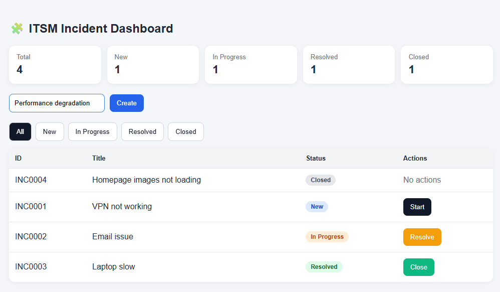
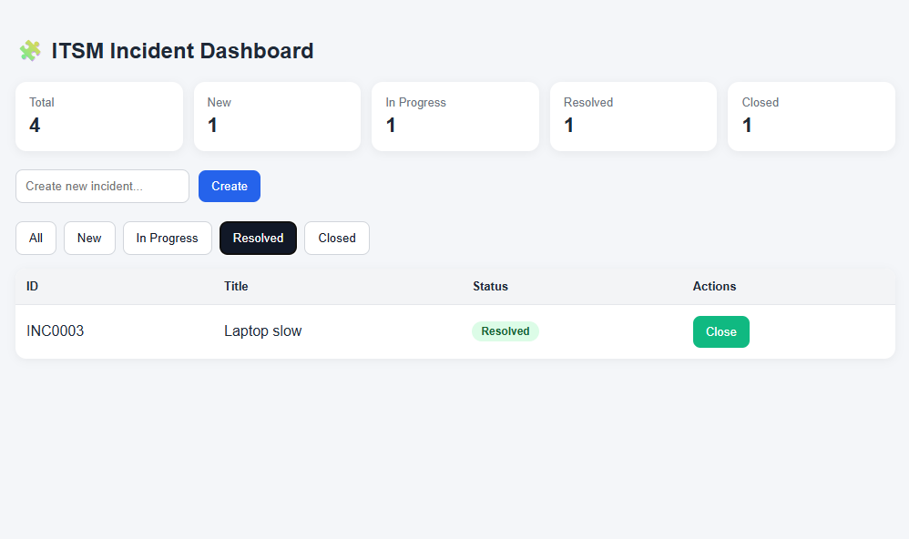
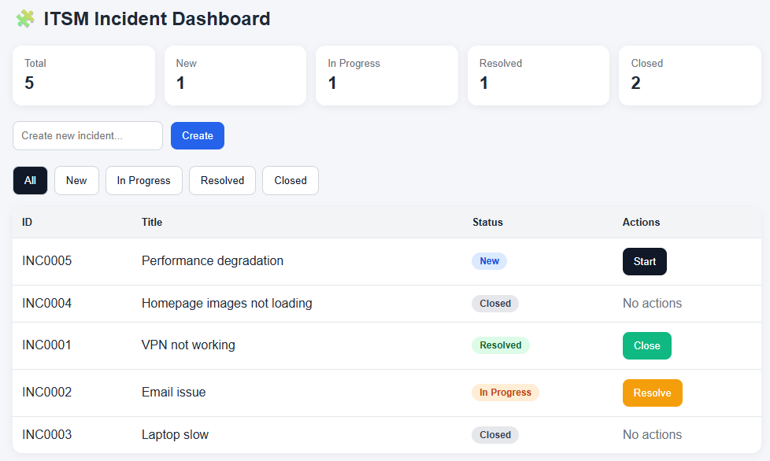

# Enterprise ITSM Workflow Platform

This project is a ServiceNow-inspired IT Service Management (ITSM) system built as a full-stack portfolio application.

It demonstrates how enterprise service platforms manage incidents, automate workflows, and provide operational visibility through dashboards.

---

## 🌐 Live Demo

👉 https://vlastilena.github.io/itsm-workflow-system

> The frontend is deployed via GitHub Pages and runs directly in the browser.

---

## 📸 Screenshots

### Dashboard Overview

### Filtering Incidents

### Workflow Actions

---

## 🎯 Business Context

In enterprise environments, ITSM platforms are used to:

* Manage incidents and service requests
* Automate support workflows
* Track operational performance (KPIs)
* Enforce structured lifecycle processes
* Improve service efficiency

This project simulates these capabilities in a simplified but structured way.

---

## ⚙️ Core Features

### 🧩 Incident Management

* Create new incidents
* Track lifecycle:
  **New → In Progress → Resolved → Closed**
* Structured incident IDs (INC0001 format)

---

### 📊 Dashboard & KPI Tracking

* Total incidents
* Status-based counters
* Real-time updates

---

### 🔄 Workflow Engine (Frontend Simulation)

* Status transition buttons:

  * Start
  * Resolve
  * Close
* Conditional UI logic based on state

---

### 🔍 Filtering System

* Filter incidents by status:

  * All / New / In Progress / Resolved / Closed

---

### 🎨 UI (ServiceNow-style)

* KPI cards (SaaS-style)
* Status badges (color-coded)
* Interactive table
* Clean enterprise layout

---

## 🧠 System Design

* Component-based React architecture
* State-driven UI (useState)
* Separation of concerns (UI vs logic)
* Workflow-driven interaction model

---

## 🏗️ Tech Stack

* Frontend: React
* Styling: Custom CSS (SaaS-style UI)
* Deployment: GitHub Pages

---

## 🚀 Engineering Highlights

This project demonstrates:

* ITSM domain understanding
* Workflow lifecycle modeling
* UI design inspired by enterprise platforms
* State management in React
* Structured data handling

---

## 📌 Future Improvements

* Backend (Node.js / Express API)
* Persistent storage (database)
* SLA tracking system
* Authentication & roles (ACL)
* Notifications system
* Advanced dashboard analytics

---

## 💼 Portfolio Note

This project is designed to showcase practical understanding of:

* ITSM systems (like ServiceNow)
* Workflow-driven applications
* Enterprise UI patterns
* Frontend architecture in React
